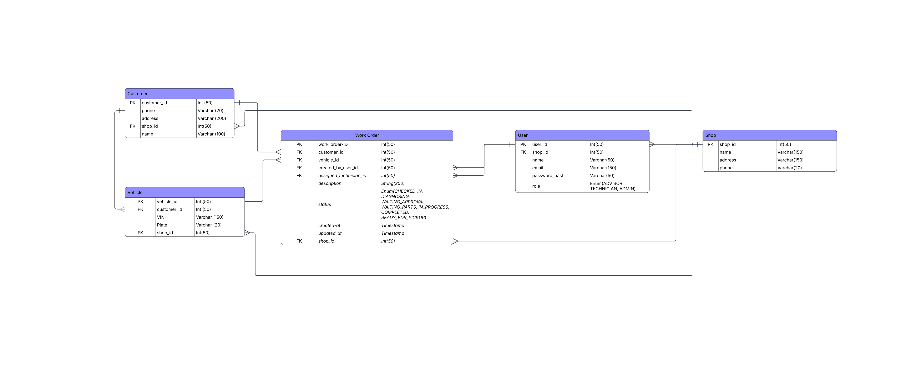

## System Design

MotorDesk was designed as a multi-tenant shop-management platform where
multiple automotive repair shops can use the same application while keeping
their data isolated.

### Functional Requirements

The core workflow allows shop staff to:

- Create and manage customers and vehicles
- Create work orders containing customer complaints or service requests
- Assign work orders to technicians
- Move work orders through their lifecycle:
  Checked In → Diagnosing → Waiting for Approval → Waiting for Parts →
  In Progress → Completed → Ready for Pickup
- View active work orders and filter them by technician, status, or customer
- Maintain vehicle service history from completed work orders

### Architecture Decisions

**Monolithic architecture**

MotorDesk begins as a monolithic application because the initial expected
scale does not justify the operational complexity of microservices. The
application can be decomposed later if scaling requirements warrant it.

**PostgreSQL**

The core domain is highly relational:

Shop → Customer → Vehicle → Work Order

Common access patterns require relationships and joins, such as retrieving
a vehicle's service history or displaying all active work orders for a shop.
PostgreSQL was therefore selected over a NoSQL database for the core
application data.

**Multi-tenancy**

Each major domain entity is scoped to a shop. This allows multiple repair
shops to use the same application while preventing one shop from accessing
another shop's customers, vehicles, users, or work orders.

### Backend Architecture

The Spring Boot backend follows a layered architecture:

Client
↓ HTTP / JSON
Controller
↓ DTO
Service
↓ Entity
Repository
↓
PostgreSQL

- **Controller** — handles HTTP requests and responses
- **DTO** — defines the data exposed through the API
- **Mapper** — converts between DTOs and persistence entities
- **Service** — contains application and business logic
- **Repository** — provides persistence through Spring Data JPA
- **PostgreSQL** — stores relational application data

DTOs are used instead of exposing JPA entities directly, separating the
external API contract from the database model.

### Primary Access Patterns

The data model is designed around common application operations:

- List active work orders for a shop
- Filter work orders by technician, status, or customer
- Search customers by identifying information
- Retrieve a vehicle's service history
- Create work orders
- Update work-order status

### Entity Relationship Diagram

